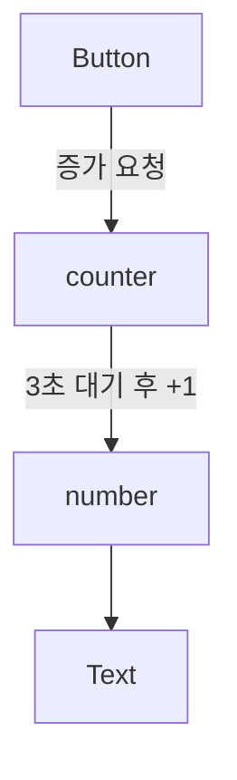

>[!question]
>GQ1. `actor`는 무엇인가?
>GQ2. `actor`는 언제 사용하는가?

## Description

공유 상태에 대한 동시 접근을 안전하게 관리하기 위해 사용하기 위한 구조체

#### Actor의 특징

- 한 번에 하나의 작업만 변경 가능한 상태에 접근할 수 있도록 허용한다.
- 외부에서 Actor와 상호작용할 때마다 비동기식으로 수행된다.
- 데이터 경합을 컴파일 타임에 방지하여 안전한 동시성 프로그래밍을 가능하게 한다.

## 주요 기능

#### Actor 정의

클래스와 유사하지만 `actor` 키워드를 사용한다.

```swift
actor Counter {
    var count: Int = 0
    
    func increment() {
        self.count += 1
    }
    
    func getCount() -> Int {
        return count
    }
}
```

#### Actor 사용

Actor의 메서드나 프로퍼티에 접근할 때는 `await` 키워드를 사용해야 한다.

```swift
func someMethod() async {
    let counter = Counter()
    await counter.increment()
    let currentCount = await counter.getCount()
    print("Current count: \(currentCount)")
}
```

## 코드 예시

```Swift
import SwiftUI

actor LemonActorCounter {
    var number = 0

    func increment() async {
        // 3초 대기
        try? await Task.sleep(for: .seconds(3))
        
        number += 1
    }

    func getNumber() -> Int {
        return number
    }
}

struct LemonActorView: View {
    private let counter = LemonActorCounter()

    @State private var number = 0

    var body: some View {
        // actor의 프로퍼티는 직접 접근할 수 없다.
        Text("Number: \(number)")

        Button("Increment") {
            Task {
                await counter.increment()
                // `actor`의 메서드는 `await`를 사용해야 한다.
                number = await counter.getNumber()
            }
        }
    }
}

#Preview {
    LemonActorView()
}
```



## Keywords

- [[async-await]]
- [[Task]]

## References

- [Actor | Apple Developer Documentation](https://developer.apple.com/documentation/swift/actor)